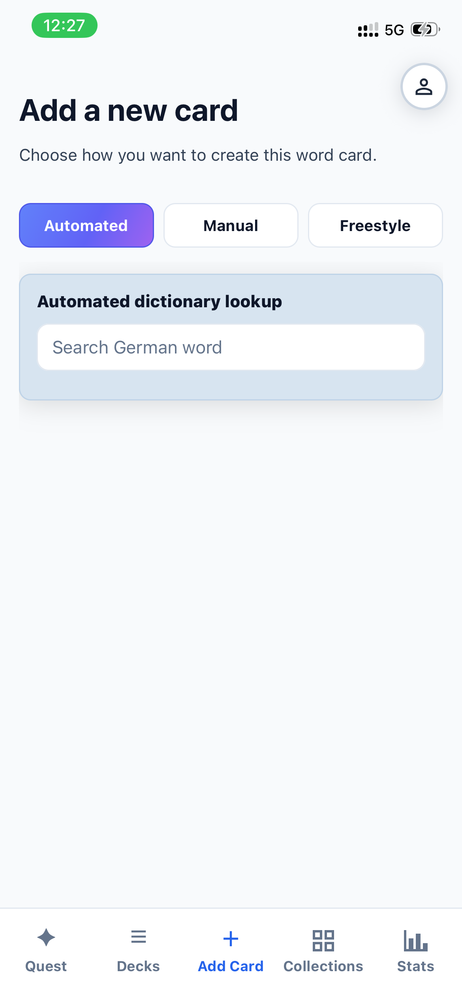
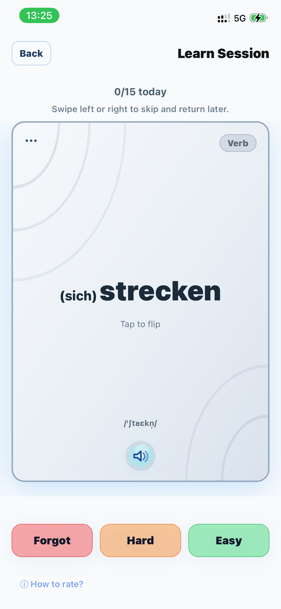
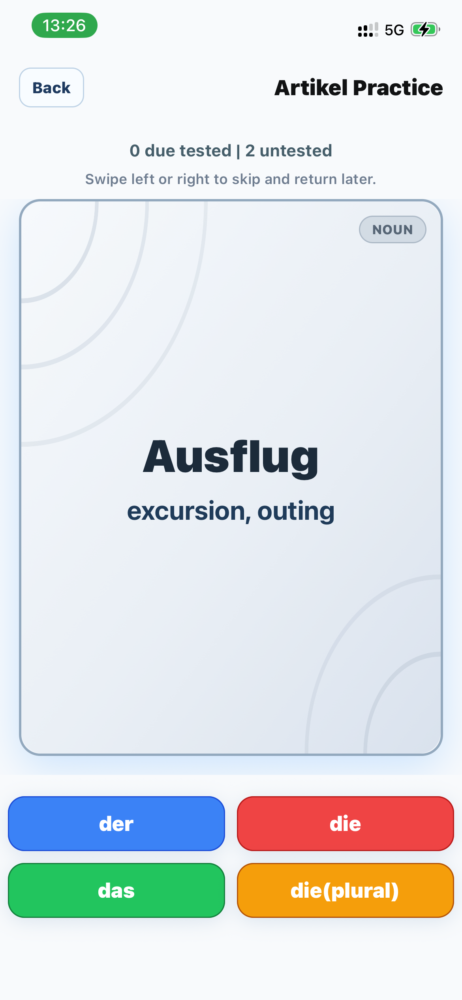
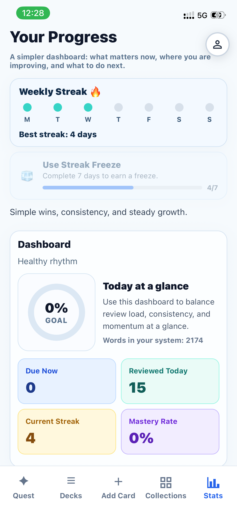

# Flewi

Flewi is a German vocabulary learning app focused on making acquisition fast and effective:

- Automated flashcard creation from German words
- Color-coded articles (der/die/das) for nouns
- Automatic word categorization (verb, noun, adjective, adverb, ...)
- Spaced repetition (SRS) — reviews scheduled by how well you know each word
- Artikel Practice — guess der/die/das/plural with color-coded feedback
- Collection decks & sets to browse and download curated word lists
- Progress tracking: streak, mastery rate, daily dashboard
- Pronunciation audio per word
- Install as a PWA (works offline, add to home screen)

## Tech stack

- Frontend: React (Vite), Tailwind CSS
- Backend: FastAPI (Python)
- Database: PostgreSQL
- Cache / queues: Redis
- Reverse proxy / TLS: Caddy (in production)
- Containers: Docker / Docker Compose

## Run (Docker)

```bash
git clone https://github.com/ma6di/Flewi.git
cd Flewi

docker compose up -d
```

Open http://localhost

## Install (PWA)

Flewi supports installation as a Progressive Web App (PWA).

- iOS (Safari): open the site → Share → Add to Home Screen
- Android (Chrome): open the site → menu (⋮) → Install app / Add to Home screen
- Desktop (Chrome/Edge): click the install icon in the address bar (if shown)

## Screenshots

Flashcard review



Spaced repetition



Artikel Practice



Collection decks


Progress & streak



