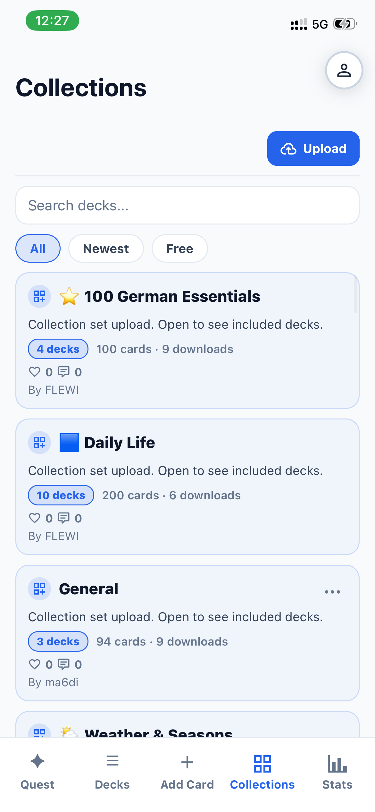

# Flewi 🦉

**Flewi** is a production-grade, full-stack German vocabulary learning platform designed to make language acquisition fast and effective. Built from the ground up to showcase modern web development practices, it features a custom spaced-repetition algorithm, a highly responsive native-like UI, seamless PWA support, and a robust microservices backend.

*This repository serves as a showcase of my ability to architect, develop, and deliver a complete, scalable product.*

## ✨ Engineering Highlights

- **Advanced Spaced Repetition Algorithm (SRS):** Engineered a custom scheduling engine that optimizes memory retention by calculating dynamic review intervals, ensuring users only study what they are about to forget.
- **Native-Like PWA Experience:** Highly polished frontend with fluid gesture-driven animations, complex state management, and an installable Progressive Web App architecture for instant, app-like access.
- **High-Performance Backend:** Asynchronous Python backend powered by FastAPI, backed by PostgreSQL for relational data and Redis for caching and session management.
- **Fully Dockerized Infrastructure:** Containerized across multiple microservices (Frontend, API, DB, Cache, Reverse Proxy) with a streamlined production deployment pipeline.

## 📸 Visual Tour

  
  
  
  
  

## 🚀 Key Features

### 🎨 Artikel Practice & Gamification
Mastering German noun genders (der, die, das) and plurals is notoriously difficult. Flewi solves this using gamified, color-coded feedback where visual associations cement correct genders effortlessly.

### 📚 Smart Categories & Collection Decks
Words are automatically parsed and categorized by part of speech. The app includes a marketplace of curated **Collection Decks** that users can instantly pull into their learning queue.

### 🎙️ Real-Time Guided Pronunciation
Integrates clean, native-sounding text-to-speech audio generated dynamically for every vocabulary card, enhancing reading comprehension alongside listening skills.

### 🔥 Rich Progress Tracking & Analytics
Features a comprehensive daily dashboard tracking learning milestones, visual mastery rates, and engagement streaks to drive user retention.

## 🛠️ Tech Stack

**Frontend:**
- **React.js (Vite)** / React Router
- **Tailwind CSS** for rapid, responsive styling
- Custom gestures & animation logic
- PWA configuration (Service Workers, Web Manifests)

**Mobile App (iOS/Android):**
- **React Native (Expo)** for high-performance cross-platform mobile development
- **Authentication:** Native Sign in with Apple & Google Auth integration
- **Monetization:** Fully integrated App Store in-app subscriptions / purchases
- **Audio Generation:** Real-time Google Cloud Text-to-Speech (TTS) integration
- **Engagement:** Local and push notifications for streak reminders and spaced repetition scheduling

**Backend:**
- **FastAPI (Python)** for high-throughput, async REST APIs
- **SQLAlchemy ORM** & Alembic for database migrations
- **PostgreSQL** for robust, relational data storage
- **Redis** for caching, pub/sub, and fast ephemeral state

**Infrastructure & DevOps:**
- **Docker** & **Docker Compose** for orchestration
- **Caddy** as a modern reverse proxy with automatic TLS
- Engineered for seamless, zero-downtime deployments

## 🌍 Live Application

**Experience the platform live:** [flewi.app](https://flewi.app)

Currently available as a high-performance responsive web application. 

**Native Apps:**
- 🍎 **iOS App:** Coming soon to the App Store.
- 🤖 **Android App:** Coming soon to the Google Play Store.

## 📱 Install (PWA)

While the native apps are being finalized, Flewi supports seamless installation as a Progressive Web App (PWA) for an immediate native-app feel.

- **iOS (Safari):** Open [flewi.app](https://flewi.app) → Share → Add to Home Screen
- **Android (Chrome):** Open [flewi.app](https://flewi.app) → Menu (⋮) → Install app
- **Desktop (Chrome/Edge):** Click the install icon in the address bar
